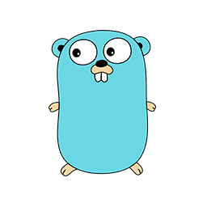

# Example API REST in GO

> The implementation using [ECHO web framework](https://echo.labstack.com/)

## Install "GO"

- For MAC: [go/MAC](https://dl.google.com/go/go1.14.darwin-amd64.pkg)

- For Windows: [go/Windows](https://dl.google.com/go/go1.14.windows-amd64.msi)

- For Linux: [go/Linux](https://dl.google.com/go/go1.14.linux-amd64.tar.gz)

## How do I use

- Clone repository

```go
 go mod download
```

- Migration system<br/>
  Migrations will executation with [gormigrate](gopkg.in/gormigrate.v1).<br/>
  [gormigrate](gopkg.in/gormigrate.v1) working together [gorm](gopkg.in/gorm.v1) for execute migrations

  - Execute initial migrations
    ```go
    go run run-migrations.go
    ```

  - Create a new migration<br/>
    You'll add a new file in folder /migration. File name will migration id.
    


- Run app
  - In terminal
    ```go
    go run src/main.go
    ```

  - Or application Debugging for VSCODE.<br/>
    Install extension [golang](ms-vscode.go) for VSCODE.
    In [launch.json](https://github.com/dev-jpnobrega/api-rest/blob/master/.vscode/launch.json) set your envs.<br/>
    Click F5 and add your breakpoints.

  - Or run in docker.<br/>
    Docker compose will create postgres db and its application.
     ```cmd
    docker-compose up
    ```

- Run Unit tests
  - In terminal
    ```go
    go test  ./test/unit/... -race -covermode=atomic  -v -coverpkg=./src/... -coverprofile=coverage.out
    ```

- Run Integration tests
  - In terminal
    ```go
    go test  ./test/integration/... -race -covermode=atomic  -v -coverpkg=./src/... -coverprofile=coverage.out
    ```

- Run All tests
  - In terminal
    ```go
    go test  ./test/... -race -covermode=atomic  -v -coverpkg=./src/... -coverprofile=coverage.out
    ```

- Export (HTML) collection coverage
  - In terminal
    ```go
    go tool cover -html=coverage.out -o=coverage.html
    ```


## Contributing

If you've ever wanted to contribute to open source, and a great cause, now is your chance!

See the [contributing docs](https://github.com/dev-jpnobrega/api-rest/blob/master/CONTRIBUTING.md) for more information

## Contributors ✨

<!-- ALL-CONTRIBUTORS-LIST:START - Do not remove or modify this section -->
<!-- prettier-ignore-start -->
<!-- markdownlint-disable -->

<table>
  <tr>
    <td align="center"><a href="https://github.com/dev-jpnobrega"><br /><sub><b>JP. Nobrega</b></sub></a><br /><a href="https://github.com/dev-jpnobrega/api-rest/issues" title="Answering Questions">💬</a> <a href="https://github.com/dev-jpnobrega/api-rest/master#how-do-i-use" title="Documentation">📖</a> <a href="https://github.com/dev-jpnobrega/api-rest/pulls" title="Reviewed Pull Requests">👀</a> <a href="#talk-kentcdodds" title="Talks">📢</a></td>
  </tr>
</table>

<!-- markdownlint-enable -->
<!-- prettier-ignore-end -->
<!-- ALL-CONTRIBUTORS-LIST:END -->

## License
[MIT](https://github.com/all-contributors/all-contributors/blob/master/LICENSE)


